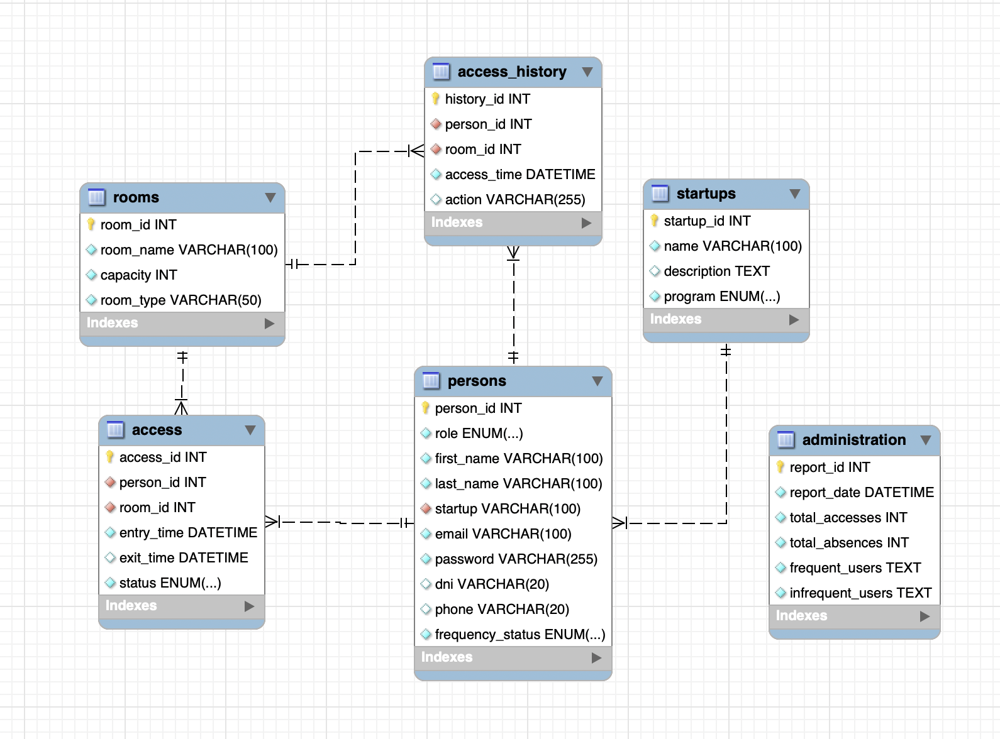

# 💼 Las Naves - Coworking Managment System

This is an innovative web application designed to streamline the management of Las Naves coworking space. This platform provides a comprehensive solution for tracking room access, managing user profiles, and optimizing space utilization. 

The application caters to both administrators and users, offering features that enhance security, improve operational efficiency, and facilitate communication within the coworking environment. With a user-friendly interface, **Las Naves - Coworking** allows users to easily navigate through available rooms and access important information regarding their usage.

Built with modern web technologies, including TypeScript, Express.js, and TypeORM, the application ensures a robust and scalable architecture. It is designed to adapt to the evolving needs of coworking spaces, making it an essential tool for organizations looking to enhance their workspace management.

Whether you are a startup, freelancer, or a team looking for a collaborative environment, **Las Naves - Coworking** provides the tools necessary to create a productive and secure workspace.

## 🛠️ Features

- **🔒 Access Logging**: The system allows for the registration of individuals accessing different rooms, capturing essential details such as access time, room information, and user identity.
- **📜 Access History**: Administrators can review a complete history of all access records, providing insights into room usage and occupancy patterns.
- **👥 User Management**: The application supports the management of user profiles, enabling the addition, updating, and removal of users while ensuring that only authorized personnel can access specific areas.
- **📊 Reporting**: The system generates detailed reports based on access history, offering insights into usage patterns and security, and allowing for data export for further analysis.
- **🚀 Startup Management**: The application includes functionalities for managing startup information, allowing for the creation, updating, and deletion of startup records, as well as retrieving associated personnel.
- **🏢 Room Management**: Users can create, update, and delete room records, as well as view the current state of rooms, including occupancy and capacity details.
- **🔐 Access Control**: The application provides mechanisms for checking in and checking out of rooms, ensuring accurate tracking of room usage and reservations. Additionally, a cron job has been implemented to automatically check out all users at the end of each day when the coworking space closes, in case they forget to do so manually.

## 🚀 Deploy

**In progress...**

    <a href="https://coworkin.zeabur.app/"><strong> Click here! </strong></a>🚀🚀🚀

## ⚙️ Stack

    </a>

## 🗄️ Database Schema

- The database schema includes entities like `Person`, `Room`, `Access`, `Startups`, `Access_history`, and `Administration`. These tables are interconnected to provide a comprehensive system for managing access controls dynamically. The relationships between them provide a faster and more capable way of updating the data in real time environment. It is designed in SQL together with TypeORM.

## 🧑‍💻 Local Installation

1. Clone this repository
git clone https://github.com/More-Pe/backend-Coworking

2. Install dependencies
npm install -y

3. Configure the environment
DB Connection: Ensure that the backend is running properly on your local machine or on an accessible server. In the .env file in the frontend, specify the backend URL.

4. Start the development server
npm run dev

5. User Credentials
To perform tests, you can use the following pre-registered users that are defined in the backend seeders:

**Administrator**
Email: admin@admin.com Password: 123456789

**Regular User** 
Email: user@user.com Password: 123456789

**Visitor User** 
Email: visitor@visitor.com Password: 123456789

You can use these credentials to log in and explore the system's functionalities.

6. Testing the System
Once the development server is running, open your browser and navigate to http://localhost:5173 (or the port indicated in your terminal). From there, you can interact with the application.

## 🖥️ Connecting to the Frontend
Read the instructions at:

[Frontend - Las Naves Coworking](https://github.com/More-Pe/frontend-Coworking)

## 🌐 Endpoints

🔒 Authentication

| Method | URI       | Action         | Auth                | Body                                                                                   |
|--------|-----------|----------------|---------------------|----------------------------------------------------------------------------------------|
| POST   | /api/register  | Register user  | N/A (public)        | `{  "email": "userEmail", "password": "userPassword" }` |
| POST   | /api/login     | Login user     | N/A (public)        | `{ "email": "userEmail", "password": "userPassword" }`                                |

👤 Persons

| Method | URI                           | Action                                  | Auth      | Body                                                                                   |
|--------|-------------------------------|-----------------------------------------|-----------|----------------------------------------------------------------------------------------|
| GET    | /api/persons                  | Retrieve all persons                   | Token (admin) | N/A                                                                                    |
| GET    | /api/persons/:id              | Retrieve a person by ID                | Token (admin) | N/A                                                                                    |
| GET    | /api/persons/:id/current-access | Display all current accesses of user ID | Token (user) | N/A                                                                                    |
| GET    | /api/persons/:id/access-history | View user access histories              | Token (user) | N/A                                                                                    |
| POST   | /api/persons/create           | Create a new person                    | Token (admin) | `{ "first_name": "John", "last_name": "Doe", "email": "john@example.com", "password": "password", "startup": "StartupName" }` |
| PUT    | /api/persons/:id              | Update a person by ID                  | Token (admin) | `{ "first_name": "NewName", "last_name": "NewLastName", "email": "newemail@example.com" }` |
| DELETE | /api/persons/:id              | Delete a person by ID                  | Token (admin) | N/A                                                                                    |

🏠 Rooms

| Method | URI                          | Action                          | Auth        | Body                                                                                   |
|--------|------------------------------|---------------------------------|-------------|----------------------------------------------------------------------------------------|
| GET    | /api/rooms/all               | View all rooms                 | Token (user) | N/A                                                                                    |
| GET    | /api/rooms/:id               | Display room by ID             | Token (user) | N/A                                                                                    |
| GET    | /api/rooms/:id/current-state  | Display current state of a room | Token (user) | N/A                                                                                    |
| POST   | /api/rooms                   | Create a new room              | Token (admin) | `{ "room_name": "Room Name", "capacity": 10, "room_type": "Meeting" }`              |
| PUT    | /api/rooms/:id               | Update a room by ID            | Token (admin) | `{ "room_name": "New Room Name", "capacity": 15, "room_type": "Conference" }`       |
| DELETE | /api/rooms/:id               | Delete room by ID              | Token (admin) | N/A                                                                                    |

🗓 Access

| Method | URI                          | Action                          | Auth      | Body                                                |
|--------|------------------------------|---------------------------------|-----------|-----------------------------------------------------|
| GET    | /api/access/room/:id         | View current room state by ID   | Token (admin) | N/A                                                 |
| POST   | /api/access/reserve          | Create new booking              | Token (user) | `{ "room_id": "id", "date": "YYYY-MM-DD" }`      |
| POST   | /api/access/check-in/:id     | Check-in to a booking by ID     | Token (user) | N/A                                                 |
| POST   | /api/access/check-out/:id    | Check-out to a booking by ID    | Token (user) | N/A                                                 |
| DELETE | /api/access/cancel/:id       | Delete a booking by ID          | Token (user) | N/A                                                 |

🗓 Access History

| Method | URI                          | Action                          | Auth      | Body                                                |
|--------|------------------------------|---------------------------------|-----------|-----------------------------------------------------|
| GET    | /api/history/period          | View all accesses for a date period | Token (admin) | `{ "start_date": "YYYY-MM-DD", "end_date": "YYYY-MM-DD"}` |
| GET    | /api/history/room/:id        | View access history for a room  | Token (admin) | N/A                                                 |

📚 Administration

| Method | URI                          | Action                          | Auth      | Body                                                |
|--------|------------------------------|---------------------------------|-----------|-----------------------------------------------------|
| POST   | /api/report/daily            | Create a daily report for all bookings | Token (admin) | N/A                                                 |
| GET    | /api/report/room-usage/:id   | Create report for a room by ID | Token (admin) | N/A                                                 |
| GET    | /api/report/period           | Create a report for a specific date period | Token (admin) | `{ "start_date": "YYYY-MM-DD", "end_date": "YYYY-MM-DD"}` |

🚀 Startups

| Method | URI                          | Action                          | Auth      | Body                                                |
|--------|------------------------------|---------------------------------|-----------|-----------------------------------------------------|
| GET    | /api/startups                | Retrieve all startups           | Token (admin) | N/A                                                 |
| GET    | /api/startups/:id            | Retrieve a startup by ID       | Token (admin) | N/A                                                 |
| POST   | /api/startups                | Create a new startup           | Token (admin) | `{ "name": "startupName", "description": "startupDescription", "program": "ProgramName" }` |
| PUT    | /api/startups/:id            | Update a startup by ID         | Token (admin) | `{ "name": "newName", "description": "newDescription", "program": "NewProgram" }` |
| DELETE | /api/startups/:id            | Delete a startup by ID         | Token (admin) | N/A                                                 |
| GET    | /api/startups/:id/persons    | Retrieve persons associated with a startup | Token (admin) | N/A                                                 |

## 🙌 Acknowledgments

I would like to express my deepest gratitude to the GeekHubs Academy and the instructors of the Full Stack Developer Bootcamp for providing me with the opportunity to develop my skills and knowledge in software development.

Throughout the program, I had the privilege of learning from experienced instructors who not only taught me the technical skills required to build a project like this, but also instilled in me the confidence and motivation to pursue my goals.

I also want to thank my fellow classmates for their camaraderie and collaboration, specially to Yoana. Working together on projects and sharing knowledge and ideas was an essential part of my learning experience.

### Thank you!

## 📞 Contact

 